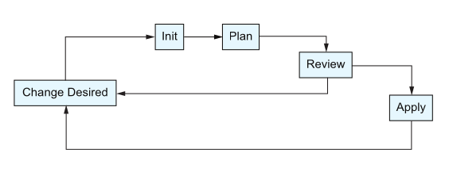

Test groud for terraform.

## Main commands
* init - Prepare your working directory for other commands
* validate - Check whether the configuration is valid
* plan - Show changes required by the current configuration
* apply - Create or update infrastructure
* destroy - Destroy previously-created infrastructure

Terraform deployment flow
 

## Blocks overview
* terraform - Used to configure Terraform and the current workspace.
* provider - Allows for provider-specific settings.
* resource - Creates and updates a corresponding piece of infrastructure. These blocks have their own subtypes that come from providers. There are potentially hundreds of thousands of resource subtypes.
* data - Is similar to a resource but is read-only and looks up existing infrastructure components. Just like resources, these have subtypes that come from providers.
* variable - Allows for external inputs to be passed into the program or module.
* locals - Contains internal variables that are scoped to a module.
* module - An abstraction that allows HCL code to be reused over and over again.
* import - A way to pull existing infrastructure into Terraform.
* moved - A tool for refactoring that allows you to change the name of resources.
* removed - Allows people to mark an item as removed without causing it to be destroyed.
* check - Used to validate deployed infrastructure.
* output - A way to share data from inside a module with other modules or workspaces.

## Blocks detail
### terraform
Defines Terraform-level settings and required providers
```terraform
terraform {
  required_providers {
    aws = {
      source  = "hashicorp/aws"
      version = "~> 5.0"
    }
  }

  required_version = ">= 1.6"
}
```
### provider
Configures how Terraform talks to a platform (AWS, Azure, etc.)
```terraform
provider "aws" {
  region = "eu-west-2"
}
```
### resource
Creates or manages infrastructure, resources are detailed [here](https://registry.terraform.io/providers/hashicorp/aws/latest)\
The resource type and name combine to make a unique identifier for the resource inside a module or workspace.
```terraform
resource "TYPE" "NAME" {
    argument = value
}
```
### data
Fetches existing infrastructure, does not create it, provides data for other elements of terraform.
```terraform
data "TYPE" "NAME" {
  filter = ...
}
```
### variable
Declares configurable inputs
```terraform
variable "region" {
  type    = string
  default = "eu-west-2"
}
```
### output
Exports values after apply
```terraform
output "bucket_name" {
  value = aws_s3_bucket.logs.bucket
}
```
### locals
Defines reusable expressions inside config
```terraform
locals {
  common_tags = {
    Project = "demo"
  }
}
```
### module
Calls another terraform package
```terraform
module "network" {
  source = "./modules/vpc"

  cidr = "10.0.0.0/16"
}
```
### backend
Configures where Terraform state lives
```terraform
terraform {
  backend "s3" {
    bucket = "tf-state"
    key    = "app.tfstate"
    region = "eu-west-2"
  }
}
```
## Sample projects in this repo
## modules
Contains my modules that are called by other projects
## hashicorp-guide
Creates an EC2 t2 micro instance from the [aws_instance](https://registry.terraform.io/providers/hashicorp/aws/6.17.0/docs/resources/instance) resource and a VPC from the [/terraform-aws-modules/vpc/aws](https://registry.terraform.io/modules/terraform-aws-modules/vpc/aws/latest) module
### lambda-api-gateway-js
Creates an S3 bucket, builds the app, deploys the app to the S3 bucket, creates a lambda that sources the app from the S3 bucket and creates an API gateway
Once applied, you can execute the following commands to check the s3 bucket, execute the lambda directly and through the API gateway
```
aws s3 ls $(terraform output -raw lambda_bucket_name)
aws lambda invoke --region=us-east-1 --function-name=$(terraform output -raw function_name) response.json
cat response.json
curl "$(terraform output -raw base_url)/hello"
curl "$(terraform output -raw base_url)/hello?Name=Terraform"
```
## lambda-local-micronaut-app
Packages a jar micronaut app and deploys to lambda\
Execute the lambda and check response with the following.
```
aws lambda invoke --region=eu-west-2 --function-name=$(terraform output -raw function_name) response.json
cat response.json
```
## module-aws-lambda-micronaut-app
Uses the [terraform-aws-modules/lambda/aws](https://registry.terraform.io/modules/terraform-aws-modules/lambda/aws/latest) module which abstracts away the majority of low level resource creation
when using aws_lambda_function and associated
## module-s3-logs-bucket
Makes use of the [s3-logs-bucket](modules/s3-logs-bucket) module 
## templatefile-docker-compose
Generates a docker compose file based on the environment, one of dev or prod, variables are specified in terraform.tfvars file
## kubernetes-local - nginx
Adds some nginx instances to a local kubernetes cluster
## kubernetes-local - monitoring
Adds the helm [kube-prometheus-stack](https://github.com/prometheus-community/helm-charts/tree/main/charts/kube-prometheus-stack)\
Check pods:\
`kubectl get pods -n monitoring`\
Access grafana:\
`kubectl port-forward svc/kube-prometheus-stack-grafana 3000:80 -n monitoring`\
http://localhost:3000\
On first deploy login with -> admin/admin